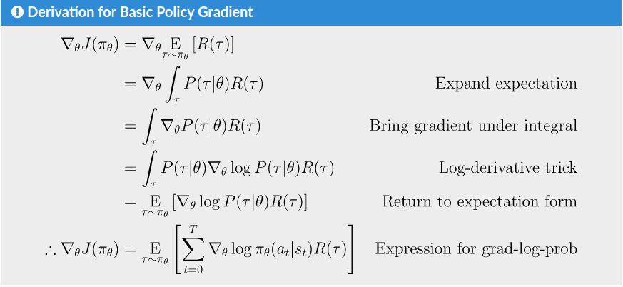

# Part 3: Intro to Policy Optimization

[link](https://spinningup.openai.com/en/latest/spinningup/rl_intro3.html)


In this section, we’ll discuss the mathematical foundations of policy optimization algorithms, and connect the material to sample code. We will cover three key results in the theory of **policy gradients**:

- [the simplest equation](https://spinningup.openai.com/en/latest/spinningup/rl_intro3.html#deriving-the-simplest-policy-gradient) describing the gradient of policy performance with respect to policy parameters,
- a rule which allows us to [drop useless terms](https://spinningup.openai.com/en/latest/spinningup/rl_intro3.html#don-t-let-the-past-distract-you) from that expression,
- and a rule which allows us to [add useful terms](https://spinningup.openai.com/en/latest/spinningup/rl_intro3.html#baselines-in-policy-gradients) to that expression.


In the end, we’ll tie those results together and describe the advantage-based expression for the policy gradient—the version we use in our [Vanilla Policy Gradient](https://spinningup.openai.com/en/latest/algorithms/vpg.html) implementation.

## Deriving the Simplest Policy Gradient

Here, we consider the case of a stochastic, parameterized policy, . We aim to maximize the expected return . For the purposes of this derivation, we’ll take  to give the [finite-horizon undiscounted return](https://spinningup.openai.com/en/latest/spinningup/rl_intro.html#reward-and-return), but the derivation for the infinite-horizon discounted return setting is almost identical.

We would like to optimize the policy by gradient ascent, eg


The gradient of policy performance, , is called the **policy gradient**, and algorithms that optimize the policy this way are called **policy gradient algorithms.** (Examples include Vanilla Policy Gradient and TRPO. PPO is often referred to as a policy gradient algorithm, though this is slightly inaccurate.)

To actually use this algorithm, we need an expression for the policy gradient which we can numerically compute. This involves two steps: 1) deriving the analytical gradient of policy performance, which turns out to have the form of an expected value, and then 2) forming a sample estimate of that expected value, which can be computed with data from a finite number of agent-environment interaction steps.

In this subsection, we’ll find the simplest form of that expression. In later subsections, we’ll show how to improve on the simplest form to get the version we actually use in standard policy gradient implementations.

We’ll begin by laying out a few facts which are useful for deriving the analytical gradient.


**1. Probability of a Trajectory.** The probability of a trajectory  given that actions come from  is


**2. The Log-Derivative Trick.** The log-derivative trick is based on a simple rule from calculus: the derivative of  with respect to  is . When rearranged and combined with chain rule, we get:


**3. Log-Probability of a Trajectory.** The log-prob of a trajectory is just


**4. Gradients of Environment Functions.** The environment has no dependence on , so gradients of , , and  are zero.

**5. Grad-Log-Prob of a Trajectory.** The gradient of the log-prob of a trajectory is thus


**Putting it all together, we derive the following:**

Derivation for Basic Policy Gradient

![\begin{align*} \nabla_{\theta} J(\pi_{\theta}) &= \nabla_{\theta} \underE{\tau \sim \pi_{\theta}}{R(\tau)} & \\ &= \nabla_{\theta} \int_{\tau} P(\tau|\theta) R(\tau) & \text{Expand expectation} \\ &= \int_{\tau} \nabla_{\theta} P(\tau|\theta) R(\tau) & \text{Bring gradient under integral} \\ &= \int_{\tau} P(\tau|\theta) \nabla_{\theta} \log P(\tau|\theta) R(\tau) & \text{Log-derivative trick} \\ &= \underE{\tau \sim \pi_{\theta}}{\nabla_{\theta} \log P(\tau|\theta) R(\tau)} & \text{Return to expectation form} \\ \therefore \nabla_{\theta} J(\pi_{\theta}) &= \underE{\tau \sim \pi_{\theta}}{\sum_{t=0}^{T} \nabla_{\theta} \log \pi_{\theta}(a_t |s_t) R(\tau)} & \text{Expression for grad-log-prob} \end{align*}](https://spinningup.openai.com/en/latest/_images/math/b5e135d2ae389147267372abc1c5b20e644ec881.svg)



This is an expectation, which means that we can estimate it with a sample mean. If we collect a set of trajectories  where each trajectory is obtained by letting the agent act in the environment using the policy , the policy gradient can be estimated with


where  is the number of trajectories in  (here, ).

This last expression is the simplest version of the computable expression we desired. Assuming that we have represented our policy in a way which allows us to calculate , and if we are able to run the policy in the environment to collect the trajectory dataset, we can compute the policy gradient and take an update step.


## Implementing the Simplest Policy Gradient

We give a short PyTorch implementation of this simple version of the policy gradient algorithm in `spinup/examples/pytorch/pg_math/1_simple_pg.py`. (It can also be viewed [on github](https://github.com/openai/spinningup/blob/master/spinup/examples/pytorch/pg_math/1_simple_pg.py).) It is only 128 lines long, so we highly recommend reading through it in depth. While we won’t go through the entirety of the code here, we’ll highlight and explain a few important pieces.


This section was previously written with a Tensorflow example. The old Tensorflow section can be found [here](https://spinningup.openai.com/en/latest/spinningup/extra_tf_pg_implementation.html#implementing-the-simplest-policy-gradient).

**1. Making the Policy Network.**

```python
# make core of policy network
logits_net = mlp(sizes=[obs_dim]+hidden_sizes+[n_acts])

# make function to compute action distribution
def get_policy(obs):
    logits = logits_net(obs)
    return Categorical(logits=logits)

# make action selection function (outputs int actions, sampled from policy)
def get_action(obs):
    return get_policy(obs).sample().item()
```


This block builds modules and functions for using a feedforward neural network categorical policy. (See the [Stochastic Policies](https://spinningup.openai.com/en/latest/spinningup/rl_intro.html#stochastic-policies) section in Part 1 for a refresher.) The output from the `logits_net` module can be used to construct log-probabilities and probabilities for actions, and the `get_action` function samples actions based on probabilities computed from the logits. (Note: this particular `get_action` function assumes that there will only be one `obs` provided, and therefore only one integer action output. That’s why it uses `.item()`, which is used to [get the contents of a Tensor with only one element](https://pytorch.org/docs/stable/tensors.html#torch.Tensor.item).)

A lot of work in this example is getting done by the `Categorical` object on L36. This is a PyTorch `Distribution` object that wraps up some mathematical functions associated with probability distributions. In particular, it has a method for sampling from the distribution (which we use on L40) and a method for computing log probabilities of given samples (which we use later). Since PyTorch distributions are really useful for RL, check out [their documentation](https://pytorch.org/docs/stable/distributions.html) to get a feel for how they work.


**PS: You Should Know**

Friendly reminder! When we talk about a categorical distribution having “logits,” what we mean is that the probabilities for each outcome are given by the Softmax function of the logits. That is, the probability for action  under a categorical distribution with logits  is:


**2. Making the Loss Function.**

```python
# make loss function whose gradient, for the right data, is policy gradient
def compute_loss(obs, act, weights):
    logp = get_policy(obs).log_prob(act)
    return -(logp * weights).mean()
```

In this block, we build a “loss” function for the policy gradient algorithm. When the right data is plugged in, the gradient of this loss is equal to the policy gradient. The right data means a set of (state, action, weight) tuples collected while acting according to the current policy, where the weight for a state-action pair is the return from the episode to which it belongs. (Although as we will show in later subsections, there are other values you can plug in for the weight which also work correctly.)

**You Should Know**

Even though we describe this as a loss function, it is **not** a loss function in the typical sense from supervised learning. There are two main differences from standard loss functions.

**1. The data distribution depends on the parameters.** A loss function is usually defined on a fixed data distribution which is independent of the parameters we aim to optimize. Not so here, where the data must be sampled on the most recent policy.

**2. It doesn’t measure performance.** A loss function usually evaluates the performance metric that we care about. Here, we care about expected return, , but our “loss” function does not approximate this at all, even in expectation. This “loss” function is only useful to us because, when evaluated at the current parameters, with data generated by the current parameters, it has the negative gradient of performance.

But after that first step of gradient descent, there is no more connection to performance. This means that minimizing this “loss” function, for a given batch of data, has *no* guarantee whatsoever of improving expected return. You can send this loss to  and policy performance could crater; in fact, it usually will. Sometimes a deep RL researcher might describe this outcome as the policy “overfitting” to a batch of data. This is descriptive, but should not be taken literally because it does not refer to generalization error.

We raise this point because it is common for ML practitioners to interpret a loss function as a useful signal during training—”if the loss goes down, all is well.” In policy gradients, this intuition is wrong, and you should only care about average return. The loss function means nothing.


**You Should Know**

The approach used here to make the `logp` tensor–calling the `log_prob` method of a PyTorch `Categorical` object–may require some modification to work with other kinds of distribution objects.

For example, if you are using a [Normal distribution](https://pytorch.org/docs/stable/distributions.html#normal) (for a diagonal Gaussian policy), the output from calling `policy.log_prob(act)` will give you a Tensor containing separate log probabilities for each component of each vector-valued action. That is to say, you put in a Tensor of shape `(batch, act_dim)`, and get out a Tensor of shape `(batch, act_dim)`, when what you need for making an RL loss is a Tensor of shape `(batch,)`. In that case, you would sum up the log probabilities of the action components to get the log probabilities of the actions. That is, you would compute:

```
logp = get_policy(obs).log_prob(act).sum(axis=-1)
```


**3. Running One Epoch of Training.**

```python
# for training policy
def train_one_epoch():
    # make some empty lists for logging.
    batch_obs = []          # for observations
    batch_acts = []         # for actions
    batch_weights = []      # for R(tau) weighting in policy gradient
    batch_rets = []         # for measuring episode returns
    batch_lens = []         # for measuring episode lengths

    # reset episode-specific variables
    obs = env.reset()       # first obs comes from starting distribution
    done = False            # signal from environment that episode is over
    ep_rews = []            # list for rewards accrued throughout ep

    # render first episode of each epoch
    finished_rendering_this_epoch = False

    # collect experience by acting in the environment with current policy
    while True:

        # rendering
        if (not finished_rendering_this_epoch) and render:
            env.render()

        # save obs
        batch_obs.append(obs.copy())

        # act in the environment
        act = get_action(torch.as_tensor(obs, dtype=torch.float32))
        obs, rew, done, _ = env.step(act)

        # save action, reward
        batch_acts.append(act)
        ep_rews.append(rew)

        if done:
            # if episode is over, record info about episode
            ep_ret, ep_len = sum(ep_rews), len(ep_rews)
            batch_rets.append(ep_ret)
            batch_lens.append(ep_len)

            # the weight for each logprob(a|s) is R(tau)
            batch_weights += [ep_ret] * ep_len

            # reset episode-specific variables
            obs, done, ep_rews = env.reset(), False, []

            # won't render again this epoch
            finished_rendering_this_epoch = True

            # end experience loop if we have enough of it
            if len(batch_obs) > batch_size:
                break

    # take a single policy gradient update step
    optimizer.zero_grad()
    batch_loss = compute_loss(obs=torch.as_tensor(batch_obs, dtype=torch.float32),
                              act=torch.as_tensor(batch_acts, dtype=torch.int32),
                              weights=torch.as_tensor(batch_weights, dtype=torch.float32)
                              )
    batch_loss.backward()
    optimizer.step()
    return batch_loss, batch_rets, batch_lens
```


The `train_one_epoch()` function runs one “epoch” of policy gradient, which we define to be

1. the experience collection step (L67-102), where the agent acts for some number of episodes in the environment using the most recent policy, followed by
2. a single policy gradient update step (L104-111).

The main loop of the algorithm just repeatedly calls `train_one_epoch()`.


**You Should Know**

If you aren’t already familiar with optimization in PyTorch, observe the pattern for taking one gradient descent step as shown in lines 104-111. First, clear the gradient buffers. Then, compute the loss function. Then, compute a backward pass on the loss function; this accumulates fresh gradients into the gradient buffers. Finally, take a step with the optimizer.


## Expected Grad-Log-Prob Lemma

In this subsection, we will derive an intermediate result which is extensively used throughout the theory of policy gradients. We will call it the Expected Grad-Log-Prob (EGLP) lemma. [[1\]](https://spinningup.openai.com/en/latest/spinningup/rl_intro3.html#id2)

**EGLP Lemma.** Suppose that  is a parameterized probability distribution over a random variable, . Then:


**Proof**


Recall that all probability distributions are *normalized*:


Take the gradient of both sides of the normalization condition:


Use the log derivative trick to get:


| [[1\]](https://spinningup.openai.com/en/latest/spinningup/rl_intro3.html#id1) | The author of this article is not aware of this lemma being given a standard name anywhere in the literature. But given how often it comes up, it seems pretty worthwhile to give it some kind of name for ease of reference. |
| ------------------------------------------------------------ | ------------------------------------------------------------ |
|                                                              |                                                              |


## Don’t Let the Past Distract You

Examine our most recent expression for the policy gradient:


Taking a step with this gradient pushes up the log-probabilities of each action in proportion to , the sum of *all rewards ever obtained*. But this doesn’t make much sense.

Agents should really only reinforce actions on the basis of their *consequences*. Rewards obtained before taking an action have no bearing on how good that action was: only rewards that come *after*.

It turns out that this intuition shows up in the math, and we can show that the policy gradient can also be expressed by


In this form, actions are only reinforced based on rewards obtained after they are taken.

We’ll call this form the “reward-to-go policy gradient,” because the sum of rewards after a point in a trajectory,


is called the **reward-to-go** from that point, and this policy gradient expression depends on the reward-to-go from state-action pairs.

**You Should Know**

**But how is this better?** A key problem with policy gradients is how many sample trajectories are needed to get a low-variance sample estimate for them. The formula we started with included terms for reinforcing actions proportional to past rewards, all of which had zero mean, but nonzero variance: as a result, they would just add noise to sample estimates of the policy gradient. By removing them, we reduce the number of sample trajectories needed.

An (optional) proof of this claim can be found [`here`_](https://spinningup.openai.com/en/latest/spinningup/rl_intro3.html#id16), and it ultimately depends on the EGLP lemma.


## Implementing Reward-to-Go Policy Gradient

We give a short PyTorch implementation of the reward-to-go policy gradient in `spinup/examples/pytorch/pg_math/2_rtg_pg.py`. (It can also be viewed [on github](https://github.com/openai/spinningup/blob/master/spinup/examples/pytorch/pg_math/2_rtg_pg.py).)

The only thing that has changed from `1_simple_pg.py` is that we now use different weights in the loss function. The code modification is very slight: we add a new function, and change two other lines. The new function is:

```python
def reward_to_go(rews):
    n = len(rews)
    rtgs = np.zeros_like(rews)
    for i in reversed(range(n)):
        rtgs[i] = rews[i] + (rtgs[i+1] if i+1 < n else 0)
    return rtgs
```

And then we tweak the old L91-92 from:

```python
         # the weight for each logprob(a|s) is R(tau)
                batch_weights += [ep_ret] * ep_len
```

to:

```python
      # the weight for each logprob(a_t|s_t) is reward-to-go from t
                batch_weights += list(reward_to_go(ep_rews))
```

**You Should Know**

This section was previously written with a Tensorflow example. The old Tensorflow section can be found [here](https://spinningup.openai.com/en/latest/spinningup/extra_tf_pg_implementation.html#implementing-reward-to-go-policy-gradient).


## Baselines in Policy Gradients

An immediate consequence of the EGLP lemma is that for any function  which only depends on state,


This allows us to add or subtract any number of terms like this from our expression for the policy gradient, without changing it in expectation:


Any function  used in this way is called a **baseline**.

The most common choice of baseline is the [on-policy value function](https://spinningup.openai.com/en/latest/spinningup/rl_intro.html#value-functions) . Recall that this is the average return an agent gets if it starts in state  and then acts according to policy  for the rest of its life.

Empirically, the choice  has the desirable effect of reducing variance in the sample estimate for the policy gradient. This results in faster and more stable policy learning. It is also appealing from a conceptual angle: it encodes the intuition that if an agent gets what it expected, it should “feel” neutral about it.

**You Should Know**

In practice,  cannot be computed exactly, so it has to be approximated. This is usually done with a neural network, , which is updated concurrently with the policy (so that the value network always approximates the value function of the most recent policy).

The simplest method for learning , used in most implementations of policy optimization algorithms (including VPG, TRPO, PPO, and A2C), is to minimize a mean-squared-error objective:


where  is the policy at epoch . This is done with one or more steps of gradient descent, starting from the previous value parameters .


## Other Forms of the Policy Gradient

What we have seen so far is that the policy gradient has the general form


where  could be any of


or


or


All of these choices lead to the same expected value for the policy gradient, despite having different variances. It turns out that there are two more valid choices of weights  which are important to know.

**1. On-Policy Action-Value Function.** The choice


is also valid. See [this page](https://spinningup.openai.com/en/latest/spinningup/extra_pg_proof2.html) for an (optional) proof of this claim.

**2. The Advantage Function.** Recall that the [advantage of an action](https://spinningup.openai.com/en/latest/spinningup/rl_intro.html#advantage-functions), defined by , describes how much better or worse it is than other actions on average (relative to the current policy). This choice,


is also valid. The proof is that it’s equivalent to using  and then using a value function baseline, which we are always free to do.

**You Should Know**

The formulation of policy gradients with advantage functions is extremely common, and there are many different ways of estimating the advantage function used by different algorithms.

**You Should Know**

For a more detailed treatment of this topic, you should read the paper on [Generalized Advantage Estimation](https://arxiv.org/abs/1506.02438) (GAE), which goes into depth about different choices of  in the background sections.

That paper then goes on to describe GAE, a method for approximating the advantage function in policy optimization algorithms which enjoys widespread use. For instance, Spinning Up’s implementations of VPG, TRPO, and PPO make use of it. As a result, we strongly advise you to study it.


