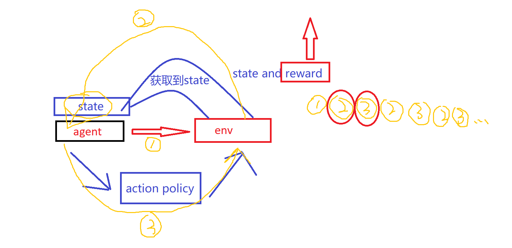
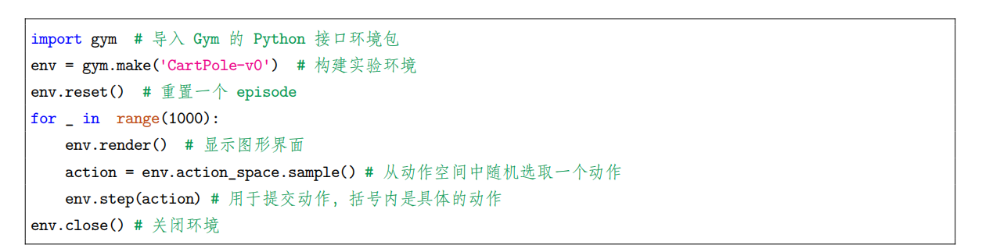

# RL

Agent	Environment	Reward

Agent 和 Env 交互，从而 最大化 奖励

那么 Agent 如何与 Env 进行交互呢？

首先， Agent 获取到一个状态 state, 然后利用这个状态，输出一个动作 action 和一个决策，然后将这个决策再放入到环境中，环境根据agent 采取的决策，输入下一个状态和当前的决策得到的奖励。

**Agent 的目的就是为了尽可能多地从环境中获取奖励**




监督学习 和 强化学习

**监督学习**，有一个标准，如果 agent 做错了，就直接知道做错了

**强化学习**，没有这个标准，如果agent 错了，是不知道错了的，需要通过和环境交互知道自己错了。

**fully observed**： 当 agent 能够观察到环境的所有状态时，我们称这个环境是完全可观测的 (fully observed)。在这种情况下面，强化学习通常被建模成一个 Markov decision process(MDP) 的问题

**partially observed**： 当 agent 只能看到部分的观测，我们就称这个环境是部分可观测的 (partially observed)，在这种情况下面，强化学习通常被建模成一个 POMDP 的问题

**Action Spaces**：不同的环境允许不同种类的动作。在给定的环境中，有效动作的集合经常被称为动作空间 (action space)

**离散动作空间**： 像 Atari 和 Go 这样的环境有离散动作空间 (discrete action spaces)，在这个动作空间里，agent 的动作数量是有限的。

**连续动作空间**：如在物理世界中控制一个 agent，在这个环境中就有连续动作空间 (continuous action spaces) 。在连续空间中，动作是实值的向量。 

**例如，走迷宫机器人如果只有东南西北这 4 种移动方式，则其为离散动作空间；如果机器人向 360*◦*** 

**中的任意角度都可以移动，则为连续动作空间。**


对于一个强化学习 agent，它可能有一个或多个如下的组成成分：

**策略函数 (policy function)**： agent 会用这个函数来选取下一步的**动作 action**

**价值函数(value function)**： 我们用价值函数来对**当前状态**进行估价，它就是说你进入现在这个状态， 可以对你后面的收益带来多大的影响。当这个价值函数大的时候，说明你进入这个状态越有利。 

**模型 (model)**： 模型表示了 agent 对这个环境的状态进行了理解，它决定了这个世界是如何进行的


**Policy**： Policy 是 agent 的行为模型，它决定了这个 agent 的**行为**，它其实是一个函数，把输入的**状态**变成**行为**


**这里有两种 policy： stochastic policy(随机性策略)，deterministic policy(确定性策略)**

**stochastic policy(随机性策略)：**当你输入一个状态 *s* 的时候，输出是一个概率。这个概率就是你所有行为的一个概率。

**deterministic policy(确定性策略)：**就是说你这里有可能只是采取它的极大化，采取最有可能的动作，你现在这个概率就是事先决定好的


**Value Function**:价值函数是未来奖励的一个预测，用来评估**状态**的好坏。价值函数的定义其实是一个期望 (期望，就是加权平均)

还有一种价值函数：Q 函数


**Model**：模型决定了下一个**状态**会是什么样的，就是说**下一步的状态**取决于你当前的**状态**以及你当前采取的**行为**。 由 **概率**和**奖励函数**两部分组成

**概率**：这个转移状态之间是怎么转移的

**奖励函数**：当你在当前状态采取了某一个**行为**，可以得到多大的奖励。


**就是说，通过使用 policy, 来选择下一步的action, 通过model, 结合当前的状态，和当前的动作，决定一下个状态，然后再通过这个下一个状态 和选择的这个action ,确定接下来的状态，如此循环。同时，在每次选择状态的时候，还可以根据value function 来评估选择状态的好坏，从而确定一下这个model 怎样**


**基于价值的 agent(value-based agent)**：这一类 agent 显式地学习的是价值函数，隐式地学习了它的策略。策略是从我们学到的价值函数里面推算出来的。 

**基于策略的 agent(policy-based agent)**：这一类 agent 直接去学习 policy，就是说你直接给它一个状态，它就会输出这个动作的概率，在基于策略的 agent 里面并没有去学习它的价值函数


**把 value-based 和 policy-based 结合起来就有了 Actor-Critic agent。**


基于**策略迭代的强化学习方法**中，智能体会制定一套动作策略，并根据这个策略进行操作。强化学习算法直接对策略进行优化，使制定的策略能够获得最大的奖励

在基于**价值迭代的强化学习方法**中，智能体不需要制定显式的策略，它维护一个价值表格或价值函 

数，并通过这个价值表格或价值函数来选取价值最大的动作

**基于价值迭代的方法只能应用在不连续的、离散的环境下（如围棋或某些游戏领域），对于行为集合规模庞大、动作连续的场景（如机器人控制领域），很难学习到较好的结果**


**基于价值**迭代的强化学习算法有： **Q-learning、Sarsa** 

**基于策略**迭代的强化学习算法有：**有策略梯度算法**

**Actor-Critic 算法同时使用策略和价值评估来做出决策**


可以通过 agent 到底有没有学习这个环境模型来分类

**model-based**(有模型) RL agent，它通过学习这个状态的转移来采取动作

**model-free**(免模型) RL agent，它没有去直接估计这个状态的转移，也没有得到环境的具体转移变量。它**通过学习价值函数和策略函数**进行决策


可以用马尔可夫决策过程来定义强化学习任务，并表示为四元组 *< S, A, P, R >*，即**状态集合**、**动作集合**、**状态转移函数**和**奖励函数**


**有模型学习**：当智能体知道**状态转移函数**和**奖励函数**后，它就能知道在某一状态下执行某一动作后能带来的奖励和环境的下一状态，这样智能体就不需要在真实环境中采取动作，直接在虚拟世界中学习和规划策略即可


**无模型学习：**在实际应用中，智能体并不是那么容易就能知晓 MDP 中的所有元素的，通常情况下，**状态转移函数**和**奖励函数**很**难估计**，甚至连环境中的状态都可能是未知的。免模型习没有对真实环境进行建模，智能体只能在真实环境中通过一定的策略来执行动作，等待奖励和状态迁移，然后根据这些反馈信息来更新行为策略，这样反复迭代直到学习到最优策略。


**针对是否需要对真实环境建模，强化学习可以分为有模型学习和免模型学习**  

**model-base** 和 **model-free**


 **Exploration and Exploitation**:在强化学习里面，探索和利用是两个很核心的问题。探索是说我们怎么去探索这个环境，通过尝试不同的行为来得到一个最佳的策略，得到最大奖励的策略。利用是说我们不去尝试新的东西，就采取已知的可以得到很大奖励的行为.


**OpenAI Gym** 是一个环境仿真库，里面包含了很多现有的环境。针对不同的场景，我们可以选择不同 

的环境.

**离散控制场景** (输出的动作是可数的，比如 Pong 游戏中输出的向上或向下动作)：一般使用 Atari 环 

境评估 

**连续控制场景** (输出的动作是不可数的，比如机器人走路时不仅有方向，还要角度，角度就是不可数 

的，是一个连续的量)：一般使用 mujoco 环境评估

**Gym Retro** 是对 Gym 环境的进一步扩展，包含了更多的一些游戏。


在 OpenAI Gym 里面有很经典的控制类游戏。 

* Acrobot 就是把两节铁杖甩了立起来。 

* CartPole 是通过控制一个平板，让木棍立起来。 

* MountainCar 是通过前后移动这个车，让它到达这个旗子的位置


如果绘制了实验的图形界面窗口，那么关闭该窗口的最佳方式是调用 env.close()。试图直接关 

闭图形界面窗口可能会导致内存不能释放，甚至会导致死机。 




想要查看当前 Gym 库已经注册了哪些环境，可以使用以下代码：


```python
from gym import envs
env_specs = envs.registry.all()
envs_ids = [env_spec.id for env_spec in env_specs]
print(envs_ids)
```


每个环境都定义了自己的**观测空间**和**动作空间**。环境 env 的观测空间用 **env.observation_space** 表示， 动作空间用 **env.action_space** 表示。观测空间和动作空间既可以是**离散空间**（即取值是有限个离散的值）， 也可以是**连续空间**（即取值是连续的）。在 Gym 库中，离散空间一般用 **gym.spaces.Discrete** 类表示，连续空间用 **gym.spaces.Box** 类表示


Box(2,)，表示观测可以用 2 个 float 值表示,Dicrete(3)，表示动作取值自 0,1,2。对于离散空间，gym.spaces.Discrete 类实例的成员 n 表示有几个可能的取值；对于连续空间，Box 类实例的成员 low 和 high 表示每个浮点数的取值范围.


**总结一下 Gym 的用法**：使用 env=gym.make(环境名) 取出环境，使用 env.reset() 初始化环境，使用 

env.step(动作)执行一步环境，使用 env.render() 显示环境，使用 env.close() 关闭环境

Gym 有对应的官方文档，大家可以阅读文档来学习 Gym。


 **Keywords**：

* 强化学习（Reinforcement Learning）：Agent 可以在与复杂且不确定的 Environment 进行交互时，尝试使所获得的 Reward 最大化的计算算法。 

* Action: Environment 接收到的 Agent 当前状态的输出。 

* State：Agent 从 Environment 中获取到的状态。 

* Reward：Agent 从 Environment 中获取的反馈信号，这个信号指定了 Agent 在某一步采取了某个策略以后是否得到奖励。 

* Exploration：在当前的情况下，继续尝试新的 Action，其有可能会使你得到更高的这个奖励，也有可能使你一无所有。 

* Exploitation：在当前的情况下，继续尝试已知的可以获得最大 Reward 的过程，即重复执行这个 Action 就可以了。 

* 深度强化学习（Deep Reinforcement Learning）：不需要手工设计特征，仅需要输入 State 让系统直接输出 Action 的一个 end-to-end training 的强化学习方法。通常使用神经网络来拟合 value function 或者 policy network。 

* Full observability、fully observed 和 partially observed：当 Agent 的状态跟 Environment 的状态等价的时候，我们就说现在 Environment 是 full observability（全部可观测），当 Agent 能够观察到Environment 的所有状态时，我们称这个环境是 fully observed（完全可观测）。一般我们的 Agent 不能观察到 Environment 的所有状态时，我们称这个环境是 partially observed（部分可观测）。  

* POMDP（Partially Observable Markov Decision Processes）：部分可观测马尔可夫决策过程，即马尔可夫决策过程的泛化。POMDP 依然具有马尔可夫性质，但是假设智能体无法感知环境的状态 *s*只能知道部分观测值 *o*。 

* Action space（discrete action spaces and continuous action spaces）：在给定的 Environment 中，有效动作的集合经常被称为动作空间（Action space），Agent 的动作数量是有限的动作空间为离散动作空间（discrete action spaces），反之，称为连续动作空间（continuous action spaces） 

* policy-based（基于策略的）：Agent 会制定一套动作策略（确定在给定状态下需要采取何种动作），并根据这个策略进行操作。强化学习算法直接对策略进行优化，使制定的策略能够获得最大的奖励。 

* valued-based（基于价值的）：Agent 不需要制定显式的策略，它维护一个价值表格或价值函数，并通过这个价值表格或价值函数来选取价值最大的动作。 

* model-based（有模型结构）：Agent 通过学习状态的转移来采取措施。 

* model-free（无模型结构）：Agent 没有去直接估计状态的转移，也没有得到 Environment 的具体转移变量。它通过学习 value function 和 policy function 进行决策。


environment 跟 reward function 不是我们可以控制的，environment 跟 reward function 是在开 

始学习之前，就已经事先给定的。我们唯一能做的事情是调整 actor 里面的 policy，使得 actor 可以 

得到最大的 reward。Actor 里面会有一个 policy，这个 policy 决定了 actor 的行为。Policy 就是给 

一个外界的输入，然后它会输出 actor 现在应该要执行的行为


# MDP


