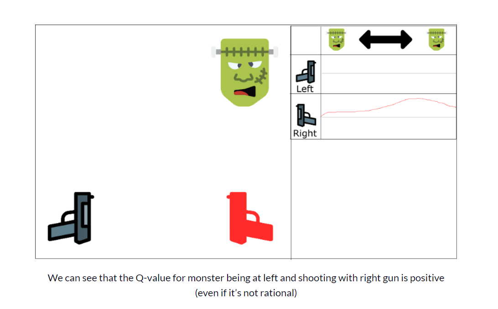

# Deep Q-Learning

[link](https://thomassimonini.medium.com/)

But as we’ll see, producing and updating a Q-table can become ineffective in big state space environments.

因为，产生一个 Q-table 效率不太高，而且环境比较大的时候，效率会很低

并且如果环境比较大的时候，action 和 space 也会比较大，这样效率就会很低，并且困难度也会增加

The best idea in this case is to create a [neural network](http://neuralnetworksanddeeplearning.com/) that will approximate, given a state, the different Q-values for each action.

所以，如果环境变大了，一个好的办法就是创建一个 neural network， 神经网络，给动作一个状态和不同的Q-value值

## **How does Deep Q-Learning work?**

This will be the architecture of our Deep Q Learning:

这是一个 Deep Q Learning  的结构图

This can seem complex, but I’ll explain the architecture step by step.

一步一步解释

这个 Deep Q Neural Network (DQNN) **将四个帧的堆栈作为输入**。 然后通过神经网络后，为给定状态下的每个可能的动作输出Q值的向量（集合）。我们需要取这个向量的最大Q值找到我们的最佳动作

一开始，代理人表现很差。但随着时间的推移，它开始将框架(状态)与最佳行动联系起来。

## **Preprocessing part** 过程

因为帧是输入的部分，输入4个帧动画，所以有一个过程是对帧进行处理

We want to reduce the complexity of our states to reduce the computation time needed for training.

我们希望的是减少状态的复杂度，从而减少状态所需要的计算时间

首先，我们可以对每个状态进行灰度化。颜色并不能添加重要信息(在我们的例子中，我们只需要找到敌人并杀死他，我们并不需要颜色去找到他)。这是一个重要的节省，因为我们减少了我们的三个颜色通道(RGB)到1(灰度)

Then, we crop the frame. In our example, seeing the roof is not really useful.

然后对帧进行处理

裁剪帧，因为在这个游戏里边，房顶没啥用

stack four sub-frames together

然后，减小帧的size,  然后将这四个帧叠在一起

## **The problem of temporal limitation** 时间限制问题

[Arthur Juliani](https://www.freecodecamp.org/news/an-introduction-to-deep-q-learning-lets-play-doom-54d02d8017d8/undefined) gives an awesome explanation about this topic in [his article](https://medium.com/emergent-future/simple-reinforcement-learning-with-tensorflow-part-8-asynchronous-actor-critic-agents-a3c-c88f72a5e9f2). He has a clever idea: using [LSTM neural networks](http://colah.github.io/posts/2015-08-Understanding-LSTMs/) for handling the problem.

初学者还是用堆叠帧的方法吧

However, I think it’s better for beginners to use stacked frames.

The first question that you can ask is why we stack frames together?

不过这里边可能会有问题，就是，为什么要堆叠这几个帧呢？

We stack frames together because it helps us to handle the problem of temporal limitation.

### 一个例子说明 temporal limitation 问题

Let’s take an example, in the game of Pong. When you see this frame:

这是一个类似乒乓球的游戏，当我们看到这个帧的时候

可以知道这个 Ball 如何行动吗？

No, because one frame is not enough to have a sense of motion!

当然不可以 ，因为一个帧是不足以对动作有感知的

But what if I add three more frames? Here you can see that the ball is going to the right.

这和对 Doom agent 做的工作是一样的，如果只是给了一个帧，是不知道动作是什么样的，也不知道方向和速度什么的，所以就不能进行判断了

## **convolution networks** 卷积网络

The frames are processed by three convolution layers. These layers allow you to exploit spatial relationships in images. But also, because frames are stacked together, you can exploit some spatial properties across those frames.

这些图层允许你利用图像中的空间关系. 但是因为这些frame 堆叠在一起， 你可以利用这些框架中的一些空间属性。

If you’re not familiar with convolution, please read this [excellent intuitive article](https://medium.com/@ageitgey/machine-learning-is-fun-part-3-deep-learning-and-convolutional-neural-networks-f40359318721) by [Adam Geitgey](https://www.freecodecamp.org/news/an-introduction-to-deep-q-learning-lets-play-doom-54d02d8017d8/undefined).

Each convolution layer will use ELU as an activation function. ELU has been proven to be a good [activation function for convolution layers.](https://arxiv.org/pdf/1511.07289.pdf)

我们使用一个具有ELU激活功能的完全连接层和一个输出层（具有线性激活功能的完全连接层）来生成每个动作的Q值估计。

We use one fully connected layer with ELU activation function and one output layer (a fully connected layer with a linear activation function) that produces the Q-value estimation for each action.

## **Experience Replay: making more efficient use of observed experience**

Experience replay will help us to handle two things:

* Avoid forgetting previous experiences. 避免遗忘那些经验
* Reduce correlations between experiences. 减少经验之间的联系

### Avoid forgetting previous experiences

We have a big problem: the variability of the weights, because there is high correlation between actions and states.

在DQN里边，我们会收取到一个  tuple(state, action, reward, new_state),  然后把这个tuple扔进神经网络 neural network 里边，然后抛出这个经验

问题是，我们将与环境交互的时候获取到的连续的样本，输入到神经网络中，这样会忘记之前的经验，因为新的经验会将原来的经验覆盖

例如：

如果我们在第一关，然后到了第二关之后，这两个关卡完全不同，我们创建的agent就是忘记第一关的时候是怎么表现的了

因此，通过多次学习，可以更有效地利用以前的经验。

As a consequence, it can be more efficient to make use of previous experience, by learning with it multiple times.

解决办法：

就是创建一个 **replay buffer**. 这个缓存里边存储了经验元组，这些经验元组来源于与环境交互时候产生。然后，我们会抽取一小批元组，并提供给神经网络

create a “**replay buffer**.”. This stores experience tuples while interacting with the environment, and then we sample a small batch of tuple to feed our neural network.

Think of the replay buffer as a folder where every sheet is an experience tuple. You feed it by interacting with the environment. And then you **take some random sheet** to feed the neural network

可以将这个 replay buffer 想象为一个文件夹，每一个 sheet 就是一个经验元组。通过与环境交互对其进行补充，然后，**随机**取几个sheet， 对神经网络进行补充

This prevents the network from only learning about what it has immediately done.

下面，就从这两个观点介绍一下 replay experience 的好处

### Reducing correlation between experiences

我们现在有另一个问题， 因为，每一个步骤都会影响到下一个状态，这会产生一个连续的元组序列，这会有很高的关联性

如果我们按顺序训练网络，则可能会导致代理受此相关性影响的风险。

If we train the network in sequential order, we risk our agent being influenced by the effect of this correlation.

因为随机抽样，这会打破这种关联，这样可以防止动作值剧烈波动或发散

By sampling from the replay buffer at random, we can break this correlation. This prevents action values from oscillating or diverging catastrophically.

It will be easier to understand that with an example. Let’s say we play a first-person shooter, where a monster can appear on the left or on the right. The goal of our agent is to shoot the monster. It has two guns and two actions: shoot left or shoot right.

We learn with ordered experience. Say we know that if we shoot a monster, the probability that the next monster comes from the same direction is 70%. In our case, this is the correlation between our experiences tuples.

Let’s begin the training. Our agent sees the monster on the right, and shoots it using the right gun. This is correct!

Then the next monster also comes from the right (with 70% probability), and the agent will shoot with the right gun. Again, this is good!

And so on and on…

The problem is, this approach increases the value of using the right gun through the entire state space.

And if our agent doesn’t see a lot of left examples (since only 30% will probably come from the left), our agent will only finish by choosing right regardless of where the monster comes from. This is not rational at all.

We have two parallel strategies to handle this problem

我们有两种并行的策略来解决这个问题

第一个策略， 我们需要在**与环境互动的时候停止学习**。我们需要尝试不同的实物并且随机的玩，从而探索实验环境。 可以将这些经验保存在一个 缓存中  replay buffer

First, we must stop learning while interacting with the environment. We should try different things and play a little randomly to explore the state space. We can save these experiences in the replay buffer.

Then, we can recall these experiences and learn from them. After that, go back to play with updated value function.

第二个策略，我们可以重新调用这些经验并且进行学习，接下来，返回去用新的这个函数进行学习

As a consequence, we will have a better set of examples. We will be able to generalize patterns from across these examples, recalling them in whatever order.

This helps avoid being fixated on one region of the state space. This prevents reinforcing the same action over and over.

## **Deep Q-Learning algorithm**

首先，先回顾一下 Q-learning的算法

Bellman equation:

在Deep Q-learning 中，我们需要更新神经网络的权重来减小错误

In our case, we want to update our neural nets weights to reduce the error.

The error (or TD error) is calculated by taking the difference between our Q_target (maximum possible value from the next state) and Q_value (our current prediction of the Q-value)

There are two processes that are happening in this algorithm:

* We sample the environment where we **perform actions** and **store the observed** **experiences tuple**s in a **replay memory**.
* Select the **small batch of tuple random** and **learn from it** using a **gradient descent update step.**

