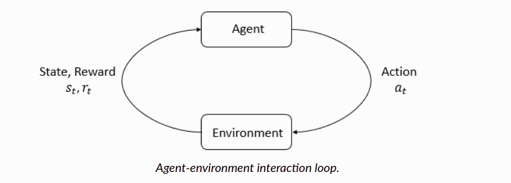

# 一. Key Concepts in RL

[link](https://spinningup.openai.com/en/latest/spinningup/rl_intro.html)

Welcome to our introduction to reinforcement learning! Here, we aim to acquaint you with

- the language and notation used to discuss the subject,
- a high-level explanation of what RL algorithms do (although we mostly avoid the question of *how* they do it),
- and a little bit of the core math that underlies the algorithms.

In a nutshell, RL is the study of **agents** and **how they learn by trial and error**. It formalizes the idea that rewarding or punishing an agent for its behavior makes it more likely to repeat or forego that behavior in the future.


## What Can RL Do?

RL methods have recently enjoyed a wide variety of successes. For example, it’s been used to teach computers to control robots in simulation and in the real world. It’s also famously been used to create breakthrough AIs for sophisticated strategy games, most notably [Go](https://deepmind.com/research/alphago/) and [Dota](https://blog.openai.com/openai-five/), taught computers to [play Atari games](https://deepmind.com/research/dqn/) from raw pixels, and trained simulated robots [to follow human instructions](https://blog.openai.com/deep-reinforcement-learning-from-human-preferences/).


## Key Concepts and Terminology 关键概念和术语



The main characters of RL are the **agent** and the **environment**. The environment is the world that the agent lives in and interacts with. At every step of interaction, the agent sees a (possibly partial) observation of the state of the world, and then decides on an action to take. The environment changes when the agent acts on it, but may also change on its own.

The agent also perceives a **reward** signal from the environment, a number that tells it how good or bad the current world state is. The goal of the agent is to maximize its **cumulative reward**, called **return**. Reinforcement learning methods are ways that the agent can learn behaviors to achieve its goal.

To talk more specifically what RL does, we need to introduce additional terminology. We need to talk about

- states and observations,
- action spaces,
- policies,
- trajectories,
- different formulations of return,
- the RL optimization problem,
- and value functions.

### States and Observations

A **state**  is a complete description of the state of the world. There is no information about the world which is hidden from the state. An **observation**  is a partial description of a state, which may omit information. （一般， state 在observation 的集合中，如果没有的话，可以加进去）

In deep RL, we almost always represent states and observations by a [real-valued vector, matrix, or higher-order tensor](https://en.wikipedia.org/wiki/Real_coordinate_space). For instance, a visual observation could be represented by the RGB matrix of its pixel values; the state of a robot might be represented by its joint angles and velocities.

When the agent is able to observe the complete state of the environment, we say that the environment is **fully observed**. When the agent can only see a partial observation, we say that the environment is **partially observed**.


PS **You Should Know**: Reinforcement learning notation sometimes puts the symbol for state, , in places where it would be technically more appropriate to write the symbol for observation, . Specifically, this happens when talking about how the agent decides an action: we often signal in notation that the action is conditioned on the state, when in practice, the action is conditioned on the observation because the agent does not have access to the state.

### Action Spaces

Different environments allow different kinds of actions. The set of all valid actions in a given environment is often called the **action space**. Some environments, like Atari and Go, have **discrete action spaces**, where only a finite number of moves are available to the agent. Other environments, like where the agent controls a robot in a physical world, have **continuous action spaces**. In continuous spaces, actions are real-valued vectors.


This distinction has some quite-profound consequences for methods in deep RL. Some families of algorithms can only be directly applied in one case, and would have to be substantially reworked for the other.

### Policies

A **policy** is a rule used by an agent to decide what actions to take. It can be deterministic, in which case it is usually denoted by :


or it may be stochastic, in which case it is usually denoted by :


Because the policy is essentially the agent’s brain, it’s not uncommon to substitute the word “policy” for “agent”, eg saying “The policy is trying to maximize reward.”

In deep RL, we deal with **parameterized policies**: policies whose outputs are computable functions that depend on a set of parameters (eg the weights and biases of a neural network) which we can adjust to change the behavior via some optimization algorithm.

We often denote the parameters of such a policy by  or , and then write this as a subscript on the policy symbol to highlight the connection:


#### Deterministic Policies

**Example: Deterministic Policies.** Here is a code snippet for building a simple deterministic policy for a continuous action space in PyTorch, using the `torch.nn` package:

```
pi_net = nn.Sequential(
              nn.Linear(obs_dim, 64),
              nn.Tanh(),
              nn.Linear(64, 64),
              nn.Tanh(),
              nn.Linear(64, act_dim)
            )
```

This builds a multi-layer perceptron (MLP) network with two hidden layers of size 64 and  activation functions. If `obs` is a Numpy array containing a batch of observations, `pi_net` can be used to obtain a batch of actions as follows:


```
obs_tensor = torch.as_tensor(obs, dtype=torch.float32)
actions = pi_net(obs_tensor)
```


**PS: You Should Know**

Don’t worry about it if this neural network stuff is unfamiliar to you—this tutorial will focus on RL, and not on the neural network side of things. So you can skip this example and come back to it later. But we figured that if you already knew, it could be helpful.

#### Stochastic Policies

The two most common kinds of stochastic policies in deep RL are **categorical policies** and **diagonal Gaussian policies**.

[Categorical](https://en.wikipedia.org/wiki/Categorical_distribution) policies can be used in discrete action spaces, while diagonal [Gaussian](https://en.wikipedia.org/wiki/Multivariate_normal_distribution) policies are used in continuous action spaces.

Two key computations are centrally important for using and training stochastic policies:

- sampling actions from the policy,
- and computing log likelihoods of particular actions, .

In what follows, we’ll describe how to do these for both categorical and diagonal Gaussian policies.


**Categorical Policies**

A categorical policy is like a classifier over discrete actions. You build the neural network for a categorical policy the same way you would for a classifier: the input is the observation, followed by some number of layers (possibly convolutional or densely-connected, depending on the kind of input), and then you have one final linear layer that gives you logits for each action, followed by a [softmax](https://developers.google.com/machine-learning/crash-course/multi-class-neural-networks/softmax) to convert the logits into probabilities.

**Sampling.** Given the probabilities for each action, frameworks like PyTorch and Tensorflow have built-in tools for sampling. For example, see the documentation for [Categorical distributions in PyTorch](https://pytorch.org/docs/stable/distributions.html#categorical), [torch.multinomial](https://pytorch.org/docs/stable/torch.html#torch.multinomial), [tf.distributions.Categorical](https://www.tensorflow.org/versions/r1.15/api_docs/python/tf/distributions/Categorical), or [tf.multinomial](https://www.tensorflow.org/versions/r1.15/api_docs/python/tf/random/multinomial).

**Log-Likelihood.** Denote the last layer of probabilities as . It is a vector with however many entries as there are actions, so we can treat the actions as indices for the vector. The log likelihood for an action  can then be obtained by indexing into the vector:

![\log \pi_{\theta}(a|s) = \log \left[P_{\theta}(s)\right]_a.](https://spinningup.openai.com/en/latest/_images/math/ab8f7f4aaa7f1a3d1039ebdee058f297ed712c5a.svg)


**Diagonal Gaussian Policies**

A multivariate Gaussian distribution (or multivariate normal distribution, if you prefer) is described by a mean vector, , and a covariance matrix, . A diagonal Gaussian distribution is a special case where the covariance matrix only has entries on the diagonal. As a result, we can represent it by a vector.

A diagonal Gaussian policy always has a neural network that maps from observations to mean actions, . There are two different ways that the covariance matrix is typically represented.

**The first way:** There is a single vector of log standard deviations, , which is **not** a function of state: the  are standalone parameters. (You Should Know: our implementations of VPG, TRPO, and PPO do it this way.)

**The second way:** There is a neural network that maps from states to log standard deviations, . It may optionally share some layers with the mean network.

Note that in both cases we output log standard deviations instead of standard deviations directly. This is because log stds are free to take on any values in , while stds must be nonnegative. It’s easier to train parameters if you don’t have to enforce those kinds of constraints. The standard deviations can be obtained immediately from the log standard deviations by exponentiating them, so we do not lose anything by representing them this way.

**Sampling.** Given the mean action  and standard deviation , and a vector  of noise from a spherical Gaussian (), an action sample can be computed with


where  denotes the elementwise product of two vectors. Standard frameworks have built-in ways to generate the noise vectors, such as [torch.normal](https://pytorch.org/docs/stable/torch.html#torch.normal) or [tf.random_normal](https://www.tensorflow.org/versions/r1.15/api_docs/python/tf/random/normal). Alternatively, you can build distribution objects, eg through [torch.distributions.Normal](https://pytorch.org/docs/stable/distributions.html#normal) or [tf.distributions.Normal](https://www.tensorflow.org/versions/r1.15/api_docs/python/tf/distributions/Normal), and use them to generate samples. (The advantage of the latter approach is that those objects can also calculate log-likelihoods for you.)

**Log-Likelihood.** The log-likelihood of a  -dimensional action , for a diagonal Gaussian with mean  and standard deviation , is given by


### Trajectories

A trajectory  is a sequence of states and actions in the world,


The very first state of the world, , is randomly sampled from the **start-state distribution**, sometimes denoted by :


State transitions (what happens to the world between the state at time , , and the state at , ), are governed by the natural laws of the environment, and depend on only the most recent action, . They can be either deterministic,


or stochastic,


Actions come from an agent according to its policy.


**PS: You Should Know**

Trajectories are also frequently called **episodes** or **rollouts**.


### Reward and Return

The reward function  is critically important in reinforcement learning. It depends on the current state of the world, the action just taken, and the next state of the world:


although frequently this is simplified to just a dependence on the current state, , or state-action pair .

The goal of the agent is to maximize some notion of cumulative reward over a trajectory, but this actually can mean a few things. We’ll notate all of these cases with , and it will either be clear from context which case we mean, or it won’t matter (because the same equations will apply to all cases).

One kind of return is the **finite-horizon undiscounted return**, which is just the sum of rewards obtained in a fixed window of steps:(有限空间的， 无贴现然回报，就是动作是固定的，有限动作，reward 不进行discount)


Another kind of return is the **infinite-horizon discounted return**, which is the sum of all rewards *ever* obtained by the agent, but discounted by how far off in the future they’re obtained. This formulation of reward includes a discount factor :(无限控件的，贴现回报，就是动作不确定，需要经过一个折扣因子进行计算)


Why would we ever want a discount factor, though? Don’t we just want to get *all* rewards? We do, but the discount factor is both intuitively appealing and mathematically convenient. On an intuitive level: cash now is better than cash later. Mathematically: an infinite-horizon sum of rewards [may not converge](https://en.wikipedia.org/wiki/Convergent_series) to a finite value, and is hard to deal with in equations. But with a discount factor and under reasonable conditions, the infinite sum converges.


**PS: You Should Know**

While the line between these two formulations of return are quite stark in RL formalism, deep RL practice tends to blur the line a fair bit—for instance, we frequently set up algorithms to optimize the undiscounted return, but use discount factors in estimating **value functions**.


### The RL Problem

Whatever the choice of return measure (whether infinite-horizon discounted, or finite-horizon undiscounted), and whatever the choice of policy, the goal in RL is to select a policy which maximizes **expected return** when the agent acts according to it.


To talk about expected return, we first have to talk about probability distributions over trajectories.

Let’s suppose that both the environment transitions and the policy are stochastic. In this case, the probability of a  -step trajectory is:


The expected return (for whichever measure), denoted by , is then:


The central optimization problem in RL can then be expressed by


with  being the **optimal policy**.


### Value Functions

It’s often useful to know the **value** of a state, or state-action pair. By value, we mean the expected return if you start in that state or state-action pair, and then act according to a particular policy forever after. **Value functions** are used, one way or another, in almost every RL algorithm.

There are four main functions of note here.


1. The **On-Policy Value Function**, , which gives the expected return if you start in state  and always act according to policy :

   > 

2. The **On-Policy Action-Value Function**, , which gives the expected return if you start in state , take an arbitrary action  (which may not have come from the policy), and then forever after act according to policy :

   > 

3. The **Optimal Value Function**, , which gives the expected return if you start in state  and always act according to the *optimal* policy in the environment:

   > 

4. The **Optimal Action-Value Function**, , which gives the expected return if you start in state , take an arbitrary action , and then forever after act according to the *optimal* policy in the environment:

   > 


**PS: You Should Know**

When we talk about value functions, if we do not make reference to time-dependence, we only mean expected **infinite-horizon discounted return**. Value functions for finite-horizon undiscounted return would need to accept time as an argument. Can you think about why? Hint: what happens when time’s up?


There are two key connections between the value function and the action-value function that come up pretty often:


and


These relations follow pretty directly from the definitions just given: can you prove them?


### The Optimal Q-Function and the Optimal Action

There is an important connection between the optimal action-value function  and the action selected by the optimal policy. By definition,  gives the expected return for starting in state , taking (arbitrary) action , and then acting according to the optimal policy forever after.

The optimal policy in  will select whichever action maximizes the expected return from starting in . As a result, if we have , we can directly obtain the optimal action, , via


Note: there may be multiple actions which maximize , in which case, all of them are optimal, and the optimal policy may randomly select any of them. But there is always an optimal policy which deterministically selects an action.

### Bellman Equations

All four of the value functions obey special self-consistency equations called **Bellman equations**. The basic idea behind the Bellman equations is this:

> The value of your starting point is the reward you expect to get from being there, plus the value of wherever you land next.

The Bellman equations for the on-policy value functions are


where  is shorthand for , indicating that the next state  is sampled from the environment’s transition rules;  is shorthand for ; and  is shorthand for .

The Bellman equations for the optimal value functions are


The crucial difference between the Bellman equations for the on-policy value functions and the optimal value functions, is the absence or presence of the **max** over actions. Its inclusion reflects the fact that whenever the agent gets to choose its action, in order to act optimally, it has to pick whichever action leads to the highest value.


**PS: You Should Know**

The term “Bellman backup” comes up quite frequently in the RL literature. The Bellman backup for a state, or state-action pair, is the right-hand side of the Bellman equation: the reward-plus-next-value.


### Advantage Functions

Sometimes in RL, we don’t need to describe how good an action is in an absolute sense, but only how much better it is than others on average. That is to say, we want to know the relative **advantage** of that action. We make this concept precise with the **advantage function.**

The advantage function  corresponding to a policy  describes how much better it is to take a specific action  in state , over randomly selecting an action according to , assuming you act according to  forever after. Mathematically, the advantage function is defined by


**PS: You Should Know**

We’ll discuss this more later, but the advantage function is crucially important to policy gradient methods.


## (Optional) Formalism

So far, we’ve discussed the agent’s environment in an informal way, but if you try to go digging through the literature, you’re likely to run into the standard mathematical formalism for this setting: **Markov Decision Processes** (MDPs). An MDP is a 5-tuple, , where

-  is the set of all valid states,
-  is the set of all valid actions,
-  is the reward function, with ,
-  is the transition probability function, with  being the probability of transitioning into state  if you start in state  and take action ,
- and  is the starting state distribution.

The name Markov Decision Process refers to the fact that the system obeys the [Markov property](https://en.wikipedia.org/wiki/Markov_property): transitions only depend on the most recent state and action, and no prior history.


