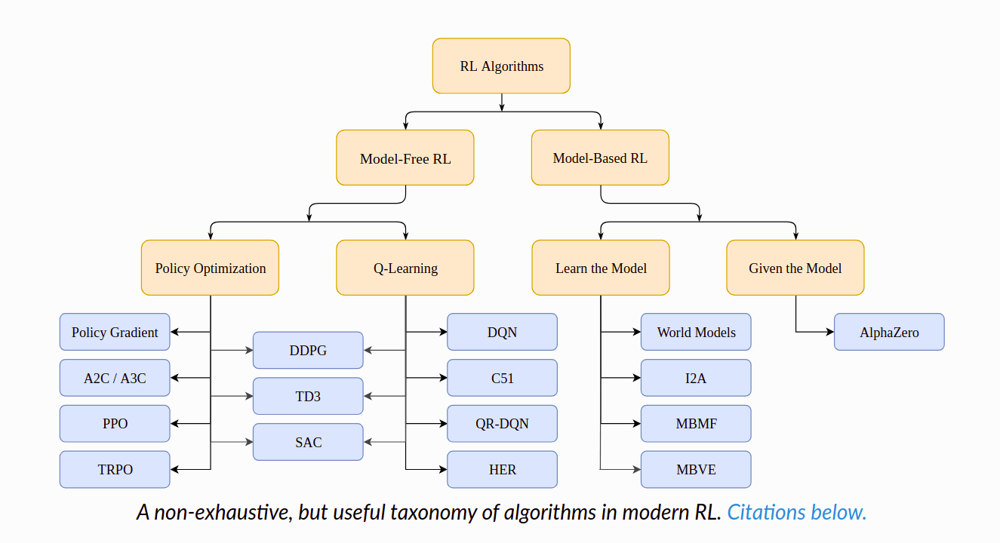

# Part 2: Kinds of RL Algorithms

[link](https://spinningup.openai.com/en/latest/spinningup/rl_intro2.html)

Now that we’ve gone through the basics of RL terminology and notation, we can cover a little bit of the richer material: the landscape of algorithms in modern RL, and a description of the kinds of trade-offs that go into algorithm design.

## A Taxonomy of RL Algorithms

We’ll start this section with a disclaimer: it’s really quite hard to draw an accurate, all-encompassing taxonomy of algorithms in the modern RL space, because the modularity of algorithms is not well-represented by a tree structure. Also, to make something that fits on a page and is reasonably digestible in an introduction essay, we have to omit quite a bit of more advanced material (exploration, transfer learning, meta learning, etc). That said, our goals here are

- to highlight the most foundational design choices in deep RL algorithms about what to learn and how to learn it,
- to expose the trade-offs in those choices,
- and to place a few prominent modern algorithms into context with respect to those choices.

### Model-Free vs Model-Based RL

One of the most important branching points in an RL algorithm is the question of **whether the agent has access to (or learns) a model of the environment**. By a model of the environment, we mean a function which predicts state transitions and rewards.

The main upside to having a model is that **it allows the agent to plan** by thinking ahead, seeing what would happen for a range of possible choices, and explicitly deciding between its options. Agents can then distill the results from planning ahead into a learned policy. A particularly famous example of this approach is [AlphaZero](https://arxiv.org/abs/1712.01815). When this works, it can result in a substantial improvement in sample efficiency over methods that don’t have a model.

The main downside is that **a ground-truth model of the environment is usually not available to the agent.** If an agent wants to use a model in this case, it has to learn the model purely from experience, which creates several challenges. The biggest challenge is that bias in the model can be exploited by the agent, resulting in an agent which performs well with respect to the learned model, but behaves sub-optimally (or super terribly) in the real environment. Model-learning is fundamentally hard, so even intense effort—being willing to throw lots of time and compute at it—can fail to pay off.

Algorithms which use a model are called **model-based** methods, and those that don’t are called **model-free**. While model-free methods forego the potential gains in sample efficiency from using a model, they tend to be easier to implement and tune. As of the time of writing this introduction (September 2018), model-free methods are more popular and have been more extensively developed and tested than model-based methods.

### What to Learn

Another critical branching point in an RL algorithm is the question of **what to learn.** The list of usual suspects includes

- policies, either stochastic or deterministic,
- action-value functions (Q-functions),
- value functions,
- and/or environment models.

#### What to Learn in Model-Free RL

There are two main approaches to representing and training agents with model-free RL:

**Policy Optimization.** Methods in this family represent a policy explicitly as . They optimize the parameters  either directly by gradient ascent on the performance objective , or indirectly, by maximizing local approximations of . This optimization is almost always performed **on-policy**, (**on-policy 不使用旧数据，每次数据都是新的，都用新数据进行更新模型**) which means that each update only uses data collected while acting according to the most recent version of the policy. Policy optimization also usually involves learning an approximator  for the on-policy value function , which gets used in figuring out how to update the policy.

A couple of examples of policy optimization methods are:

- [A2C / A3C](https://arxiv.org/abs/1602.01783), which performs gradient ascent to directly maximize performance,

- and [PPO](https://arxiv.org/abs/1707.06347), whose updates indirectly maximize performance, by instead maximizing a *surrogate objective* function which gives a conservative estimate for how much  will change as a result of the update.

  

**Q-Learning.** Methods in this family learn an approximator  for the optimal action-value function, . Typically they use an objective function based on the [Bellman equation](https://spinningup.openai.com/en/latest/spinningup/rl_intro.html#bellman-equations). This optimization is almost always performed **off-policy**, **(Q-learning 是一种 off-policy 的方法， 就是有一个Q表，不断进行更新，在下一轮循环中，继续使用Q表更新的值，也就是 old data)** which means that each update can use data collected at any point during training, regardless of how the agent was choosing to explore the environment when the data was obtained. The corresponding policy is obtained via the connection between  and : the actions taken by the Q-learning agent are given by

Examples of Q-learning methods include

- [DQN](https://www.cs.toronto.edu/~vmnih/docs/dqn.pdf), a classic which substantially launched the field of deep RL,
- and [C51](https://arxiv.org/abs/1707.06887), a variant that learns a distribution over return whose expectation is .

**Trade-offs Between Policy Optimization and Q-Learning.** The primary strength of policy optimization methods is that they are principled, in the sense that *you directly optimize for the thing you want.* This tends to make them stable and reliable. By contrast, Q-learning methods only *indirectly* optimize for agent performance, by training  to satisfy a self-consistency equation. There are many failure modes for this kind of learning, so it tends to be less stable. [[1\]](https://spinningup.openai.com/en/latest/spinningup/rl_intro2.html#id2) But, Q-learning methods gain the advantage of being substantially more sample efficient when they do work, because they can reuse data more effectively than policy optimization techniques.

**Interpolating Between Policy Optimization and Q-Learning.** Serendipitously, policy optimization and Q-learning are not incompatible (and under some circumstances, it turns out, [equivalent](https://arxiv.org/abs/1704.06440)), and there exist a range of algorithms that live in between the two extremes. Algorithms that live on this spectrum are able to carefully trade-off between the strengths and weaknesses of either side. Examples include

- [DDPG](https://arxiv.org/abs/1509.02971), an algorithm which concurrently learns a deterministic policy and a Q-function by using each to improve the other,
- and [SAC](https://arxiv.org/abs/1801.01290), a variant which uses stochastic policies, entropy regularization, and a few other tricks to stabilize learning and score higher than DDPG on standard benchmarks.

**PS**: For more information about how and why Q-learning methods can fail, see 1) this classic paper by [Tsitsiklis and van Roy](http://web.mit.edu/jnt/www/Papers/J063-97-bvr-td.pdf), 2) the (much more recent) [review by Szepesvari](https://sites.ualberta.ca/~szepesva/papers/RLAlgsInMDPs.pdf) (in section 4.3.2), and 3) chapter 11 of [Sutton and Barto](https://drive.google.com/file/d/1xeUDVGWGUUv1-ccUMAZHJLej2C7aAFWY/view), especially section 11.3 (on “the deadly triad” of function approximation, bootstrapping, and off-policy data, together causing instability in value-learning algorithms).

### What to Learn in Model-Based RL

Unlike model-free RL, there aren’t a small number of easy-to-define clusters of methods for model-based RL: there are many orthogonal ways of using models. We’ll give a few examples, but the list is far from exhaustive. In each case, the model may either be given or learned.

**Background: Pure Planning.** The most basic approach *never* explicitly represents the policy, and instead, uses pure planning techniques like [model-predictive control](https://en.wikipedia.org/wiki/Model_predictive_control) (MPC) to select actions. In MPC, each time the agent observes the environment, it computes a plan which is optimal with respect to the model, where the plan describes all actions to take over some fixed window of time after the present. (Future rewards beyond the horizon may be considered by the planning algorithm through the use of a learned value function.) The agent then executes the first action of the plan, and immediately discards the rest of it. It computes a new plan each time it prepares to interact with the environment, to avoid using an action from a plan with a shorter-than-desired planning horizon.

- The [MBMF](https://sites.google.com/view/mbmf) work explores MPC with learned environment models on some standard benchmark tasks for deep RL.

**Expert Iteration.** A straightforward follow-on to pure planning involves using and learning an explicit representation of the policy, . The agent uses a planning algorithm (like Monte Carlo Tree Search) in the model, generating candidate actions for the plan by sampling from its current policy. The planning algorithm produces an action which is better than what the policy alone would have produced, hence it is an “expert” relative to the policy. The policy is afterwards updated to produce an action more like the planning algorithm’s output.

- The [ExIt](https://arxiv.org/abs/1705.08439) algorithm uses this approach to train deep neural networks to play Hex.
- [AlphaZero](https://arxiv.org/abs/1712.01815) is another example of this approach.

**Data Augmentation for Model-Free Methods.** Use a model-free RL algorithm to train a policy or Q-function, but either 1) augment real experiences with fictitious ones in updating the agent, or 2) use *only* fictitous experience for updating the agent.

- See [MBVE](https://arxiv.org/abs/1803.00101) for an example of augmenting real experiences with fictitious ones.
- See [World Models](https://worldmodels.github.io/) for an example of using purely fictitious experience to train the agent, which they call “training in the dream.”

**Embedding Planning Loops into Policies.** Another approach embeds the planning procedure directly into a policy as a subroutine—so that complete plans become side information for the policy—while training the output of the policy with any standard model-free algorithm. The key concept is that in this framework, the policy can learn to choose how and when to use the plans. This makes model bias less of a problem, because if the model is bad for planning in some states, the policy can simply learn to ignore it.

- See [I2A](https://arxiv.org/abs/1707.06203) for an example of agents being endowed with this style of imagination.

## Links to Algorithms in Taxonomy

| [2]  | [A2C / A3C](https://arxiv.org/abs/1602.01783) (Asynchronous Advantage Actor-Critic): Mnih et al, 2016 |
| ---- | ------------------------------------------------------------ |
|      |                                                              |

| [3]  | [PPO](https://arxiv.org/abs/1707.06347) (Proximal Policy Optimization): Schulman et al, 2017 |
| ---- | ------------------------------------------------------------ |
|      |                                                              |

| [4]  | [TRPO](https://arxiv.org/abs/1502.05477) (Trust Region Policy Optimization): Schulman et al, 2015 |
| ---- | ------------------------------------------------------------ |
|      |                                                              |

| [5]  | [DDPG](https://arxiv.org/abs/1509.02971) (Deep Deterministic Policy Gradient): Lillicrap et al, 2015 |
| ---- | ------------------------------------------------------------ |
|      |                                                              |

| [6]  | [TD3](https://arxiv.org/abs/1802.09477) (Twin Delayed DDPG): Fujimoto et al, 2018 |
| ---- | ------------------------------------------------------------ |
|      |                                                              |

| [7]  | [SAC](https://arxiv.org/abs/1801.01290) (Soft Actor-Critic): Haarnoja et al, 2018 |
| ---- | ------------------------------------------------------------ |
|      |                                                              |

| [8]  | [DQN](https://www.cs.toronto.edu/~vmnih/docs/dqn.pdf) (Deep Q-Networks): Mnih et al, 2013 |
| ---- | ------------------------------------------------------------ |
|      |                                                              |

| [9]  | [C51](https://arxiv.org/abs/1707.06887) (Categorical 51-Atom DQN): Bellemare et al, 2017 |
| ---- | ------------------------------------------------------------ |
|      |                                                              |

| [10] | [QR-DQN](https://arxiv.org/abs/1710.10044) (Quantile Regression DQN): Dabney et al, 2017 |
| ---- | ------------------------------------------------------------ |
|      |                                                              |

| [11] | [HER](https://arxiv.org/abs/1707.01495) (Hindsight Experience Replay): Andrychowicz et al, 2017 |
| ---- | ------------------------------------------------------------ |
|      |                                                              |

| [12] | [World Models](https://worldmodels.github.io/): Ha and Schmidhuber, 2018 |
| ---- | ------------------------------------------------------------ |
|      |                                                              |

| [13] | [I2A](https://arxiv.org/abs/1707.06203) (Imagination-Augmented Agents): Weber et al, 2017 |
| ---- | ------------------------------------------------------------ |
|      |                                                              |

| [14] | [MBMF](https://sites.google.com/view/mbmf) (Model-Based RL with Model-Free Fine-Tuning): Nagabandi et al, 2017 |
| ---- | ------------------------------------------------------------ |
|      |                                                              |

| [15] | [MBVE](https://arxiv.org/abs/1803.00101) (Model-Based Value Expansion): Feinberg et al, 2018 |
| ---- | ------------------------------------------------------------ |
|      |                                                              |

| [16] | [AlphaZero](https://arxiv.org/abs/1712.01815): Silver et al, 2017 |
| ---- | ------------------------------------------------------------ |
|      |                                                              |

