# Reinforcement Learning
[link](https://thomassimonini.medium.com/)

[course link](https://thomassimonini.medium.com/an-introduction-to-deep-reinforcement-learning-17a565999c0c)

理解：

强化学习的理念，是一个agent 与环境进行互动从而进行学习，并且获得一定的奖励作为每个动作的回馈

在多次的尝试和失败中进行学习，从而理解了哪些可以获得好处，哪些是充满了危险的，所以我们的目标就是通过和环境的交互，如何尽可能多的获取好处，最终获得的一系列结果，便是我们要找的目标策略 policy π *

**目标**：

在一个策略π 下（当然，也有可能是多个策略），找到可以让结果得到最大值的方式，并将这个方式视为π *。 目标就是要找到这个π *策略，可以使过程中奖惩相加后的总体奖励最高。

**Without any supervision**, the child will get better and better at playing the game.

That’s how humans and animals learn, **through interaction**

Reinforcement Learning is just a **computational approach of learning from action.**

强化学习就是，机器从各种动作的过程中进行学习

*Reinforcement learning is a framework for solving control tasks (also called decision problems) by building agents that* **learn from the environment** *by* **interacting with it** *through trial and error and* **receiving rewards** *(positive or negative)* **as unique feedback.**

## The RL Process

为了理解RL过程，让我们想象一个agent学习玩平台游戏:

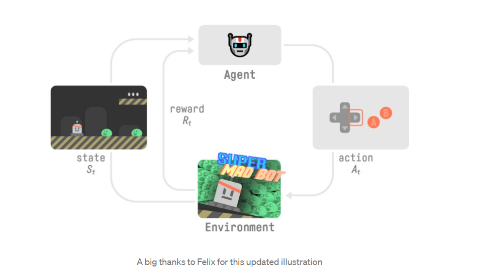

- Our Agent receives **state S0** from the **Environment** — we receive the first frame of our game (environment).
- Based on that **state S0,** the agent takes an **action A0** — our agent will move to the right.
- Environment transitions to a **new** **state S1** — new frame.
- Environment gives some **reward R1** to the agent — we’re not dead *(Positive Reward +1)*.

最开始，状态为S0, 然后，agent产生一个动作 A0, 动作结束后到了一个新的state S1,,最后，agent 获取到了一个奖励 R1， 这个奖励可能是好的，也可能是坏的， 之后，循环这个过程。 产生动作，到达新状态，获取奖励，在进行动作，获取新状态，获取奖励......

**state, action and reward and next state.**

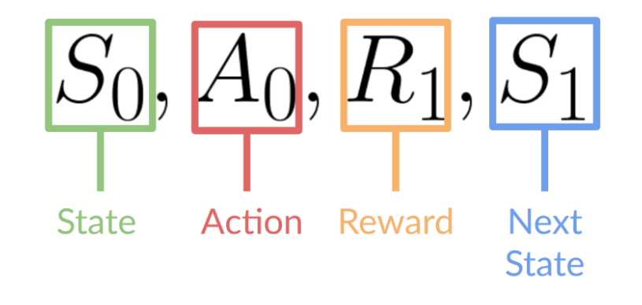  

The goal of the agent is to maximize its cumulative reward, **called the expected return.**

agent 的目标就是 获取最大的奖励，就是期望的返回值。

**The reward hypothesis: the central idea of Reinforcement Learning**

强化学习	的中心思想就是这个奖励假说

That’s why in Reinforcement Learning, **to have the best behavior,** we need to **maximize the expected cumulative reward.**

所以，为了有最好的行为，我们就要尽可能的将 累计奖励最大化

## **Markov Decision Process** (MDP). 马尔科夫决策过程

You’ll see in papers that the RL process is called the **Markov Decision Process** (MDP).

在一些论文中，强化学习的过程被叫做马尔科夫决策过程 （MDP）

We’ll talk again about the Markov Property in the next chapters. But if you need to remember something today about it is just that Markov Property implies that our agent needs **only the current state to make its decision** about what action to take and **not the history of all the states** **and actions** he took before.

也就是说，目前我们要知道的是，agent 只需要当前的状态，然后决定做什么动作，而不是根据之前的状态和动作所决定的。

## 名词解释:

### Observations/States Space

the **information our agent gets from the environment.**

代理从环境中获取的信息

There is a differentiation to make between *observation* and *state*:

* *State s*： is **a complete description of the state of the world** (there is no hidden information). In a fully observed environment.

  * 对世界状态的完整描述

  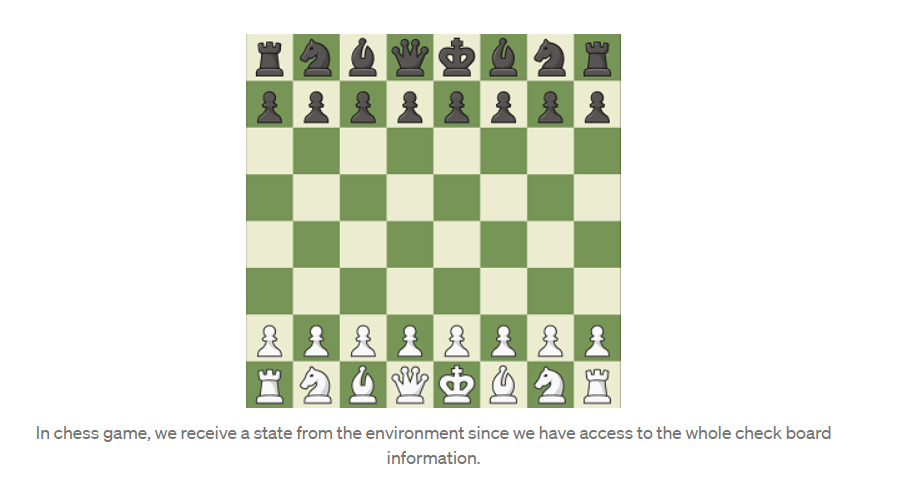

With a chess game, we are in a fully observed environment, since we have access to the whole check board information.

象棋游戏中，我们可以看到整个棋盘，这个棋盘就是一个环境，所以这种可以看到整个环境的就是一个state space 

* *Observation o*： is a **partial description of the state.** In a partially observed environment.

  * 这是一个进行局部观察的环境中，不能观看的全貌就叫  observation

  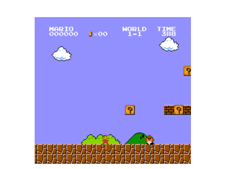

In Super Mario Bros, we are in a partially observed environment, we receive an observation **since we only see a part of the level.**

就像马里奥游戏，因为我们就能看见关卡的一部分，不能看到所有的场景，所以就叫观察空间 observation space

现实中使用的时候，这两种情况都叫做 state, 但是在实现的时候是不一样的

### Action Space	

The Action space is the set of **all possible actions in an environment.**

这个动作空间，就是在一个环境中所有可能的动作的集合

The actions can come from a *discrete* or *continuous space*:

可能来自于离散或者连续的空间

* *Discrete space*：  the number of possible actions is **finite**.
  * 所有可能的动作是有限的，只能做几个动作 finite

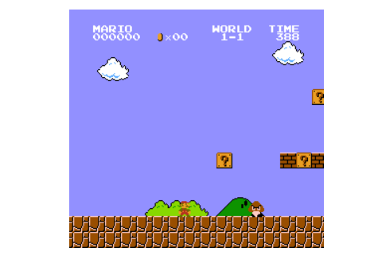

In Super Mario Bros, we have a finite set of actions since we have only 4 directions and jump.

马里奥游戏里边，我们能做的动作就只有  上下左右4个方向，和跳跃

* *Continuous space*： the number of possible actions is **infinite**.

  * 可能的动作是没有数量限制的

  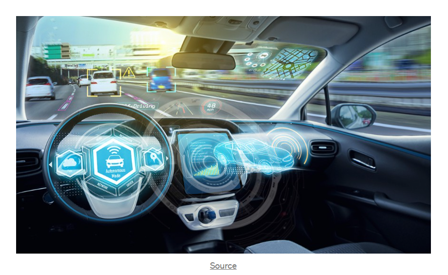

A Self Driving Car agent has an infinite number of possible actions since he can turn left 20°, 21°, 22°, honk, turn right 20°, 20,1°…

就像自动驾驶的汽车，转向可能是任意的度数，所以动作 action is infinite

Taking this information into consideration is **crucial** because it will **have importance when we will choose in the future the RL algorithm.**

### Rewards and the discounting

奖励和折扣

The reward is fundamental in RL because it’s **the only feedback** for the agent. Thanks to it, our agent knows **if the action taken was good or not.**

这个奖励是agent 从环境得到的唯一的反馈，通过这个奖励reward, agent知道他所做的这个动作是好的还是坏的

The cumulative reward at each time step t can be written as:

总的奖励值：  就是每个步骤的奖励之和

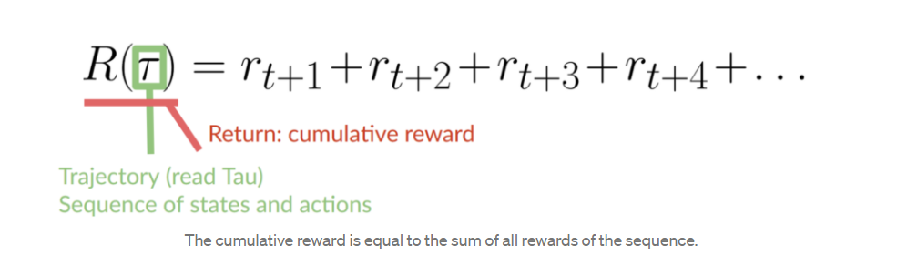

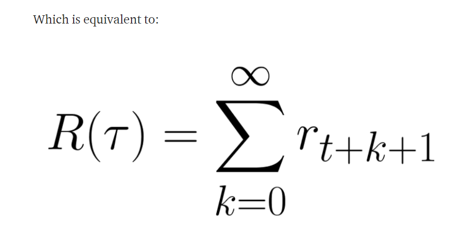

However, in reality, **we can’t just add them like that.** The rewards that come sooner (at the beginning of the game) **are more probable to happen**, since they are more predictable than the long term future reward.

但是这种直接相加的情况，现实中确是不可靠的。

举例说明：

Let say your agent is this small mouse that can move one tile each time step, and your opponent is the cat (that can move too). Your goal is **to eat the maximum amount of cheese before being eaten by the cat.**

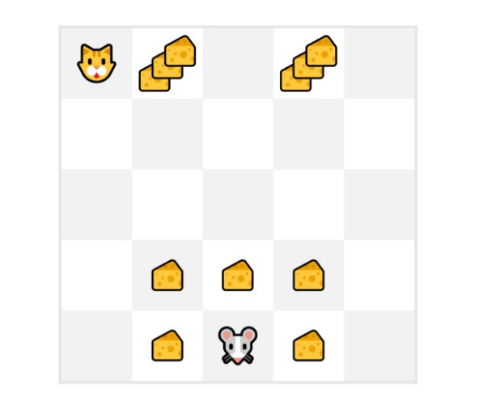

As we can see in the diagram, **it’s more probable to eat the cheese near us than the cheese close to the cat** (the closer we are to the cat, the more dangerous it is).

As a consequence, **the reward near the cat, even if it is bigger (more cheese), will be more discounted** since we’re not really sure we’ll be able to eat it.

结果是，虽然靠近猫的奖励 reward  更多，但是老鼠不知道能不能迟到，所以这种奖励也打了折扣

但是这种奖励应该如何减少呢，该过程如下：

To discount the rewards, we proceed like this:

1. We define a discount rate called gamma. **It must be between 0 and 1.**
   * 首先定义一个折现比例 gamma, 这个值在0和1之间
     * gamma 越大，折现的影响就越小，比如在老鼠周围， gamma 就可以为1， reward 就是当前的值，但是靠近猫的，折现率 gamma 就越小，那么 reward * gamma 获取到的新的 reward 也就相应的减小了
2.  Then, each reward will be discounted by gamma to the exponent of the time step.
   * 然后，每个奖励将被gamma折合为时间步长的指数

As the time step increases, the cat gets closer to us, **so the future reward is less and less probable to happen.**

Our discounted cumulative expected rewards is:

所以这个带有折扣的累计奖励为：

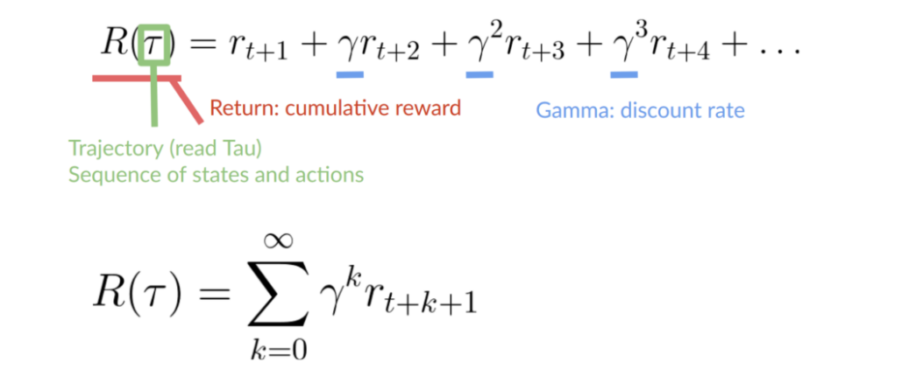

该奖励多了一个 参数 gamma

### **Type of tasks**

任务类型

A task is an **instance** of a Reinforcement Learning problem. We can have two types of tasks: episodic and continuous.

任务是强化学习问题的一个实例。我们可以有两种类型的任务:情景任务和连续任务

#### **Episodic task**

In this case, we have a starting point and an ending point **(a terminal state). This creates an episode**: a list of States, Actions, Rewards, and New States.

这种情景任务，有一个开始状态和结束状态， 那么就有了一连串的 状态，动作，奖励和新的状态等等

For instance think about Super Mario Bros, an episode begin at the launch of a new Mario Level and ending **when you’re killed or you’re reach the end of the level.**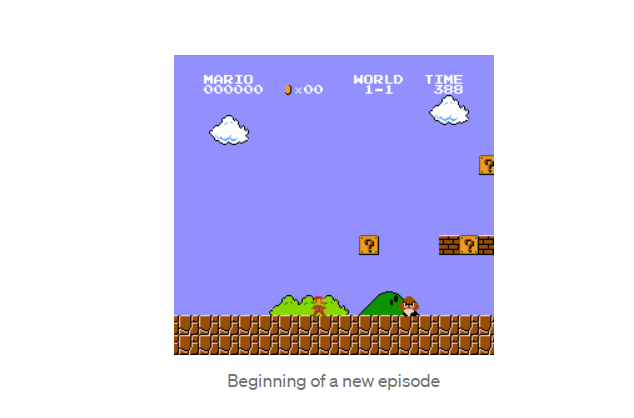

#### **Continuous tasks**

These are tasks that continue forever (no terminal state). In this case, the agent **has to learn how to choose the best actions and simultaneously interacts with the environment.**

这种连续任务，会一直持续，没有终点。 在这种情况下，agent 需要一直学习如何选择最好的动作和如何与环境进行交互

For instance, an agent that do automated stock trading. For this task, there is no starting point and terminal state. **The agent keeps running until we decide to stop him.**

例如，agent 自动进行股票交易，这没有开始和结束状态， 那么这个 agent 就会一直运行知道我们手动取消他们

### Exploration/ Exploitation tradeoff

- Exploration is exploring the environment by trying random actions in order to **find more information about the environment.**
  - Exploration 探索是通过尝试随机行动来探索环境，以便找到更多关于环境的信息
- Exploitation is **exploiting known information to maximize the reward.**
  - Exploitation 剥削就是利用已知信息来最大化回报。

强化学习的目标就是将 期望的累计奖励 reward 最大化， 但是我们会落入一个一般的陷阱

例如：

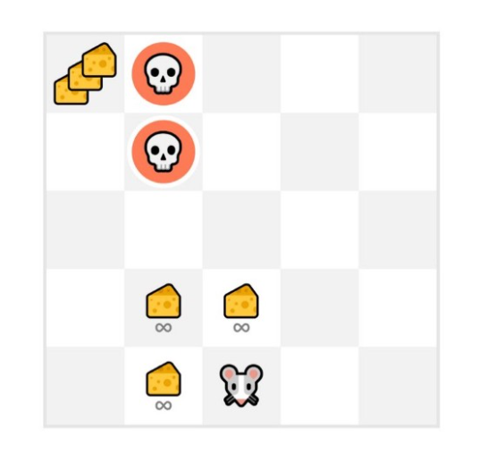

In this game, our mouse can have an **infinite amount of small cheese** (+1 each). But at the top of the maze, there is a gigantic sum of cheese (+1000).

However, if we only focus on exploitation, our agent will never reach the gigantic sum of cheese. Instead, it will only exploit **the nearest source of rewards,** even if this source is small (exploitation).

如果我们只考虑 exploitation, agent 就不会到达 大量的奶酪所在的地方， 而是在附近进行剥削

But if our agent does a little bit of exploration, it can **discover the big reward** (the pile of big cheese).

This is what we call the exploration/exploitation trade off. We need to balance how much we **explore the environment** and how much we **exploit what we know about the environment.**

这就是 exploration/exploitation trade off。我们需要平衡， 我们需要探索多少环境，和我们需要从环境中剥削多少 exploit

Therefore, we must **define a rule that helps to handle this trade-off**. We’ll see in future chapters different ways to handle it.

例2：

If it’s still confusing think of a real problem: the choice of a restaurant:

想象一个场景，选择饭店

* *Exploitation*: You go everyday to the same one that you know is good and **take the risk to miss another better restaurant.**

  

* *Exploration*: Try restaurants you never went before, with the risk of having a bad experience **but the probable opportunity of an amazing experience.**

## The two main approaches for solving RL problems

两种解决 RL problems 的主要方法：

In other terms, how to build a RL agent that can **select the actions that maximize its expected cumulative reward?**

### The Policy π: the agent’s brain

The Policy **π** is the **brain of our Agent**, it’s the function that tell us what **action to take given the state we are.** So it **defines the agent behavior** at a given time.

Policy  **π** 是agent 在大脑，告诉我们给定了状态后采取什么行动。So， 他定义了在给定的时间agent 的行为

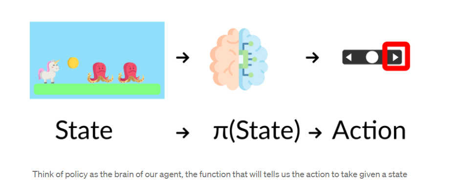

This Policy **is the function we want to learn**, our goal is to find the optimal policy **π\*, the policy that** maximizes **expected return** when the agent acts according to it. We find this **π\* through training.**

我们的目标就是找到这个最好的 π\*， 通过训练找到他

为此，有两种锻炼的方法：

- **Directly,** by teaching the agent to learn which **action to take,** given the state is in: **Policy-Based Methods.**
  - 直接法，通过教导agent 执行什么动作，这是一种Policy-Based Methods 

* Indirectly, **teach the agent to learn which state is more valuable** and then take the action that **leads to the more valuable states**: **Value-Based Methods.**
  * 间接法 ， 教导agent 那个状态更有价值， 然后执行那种可以获取更多有价值的状态的动作，这叫做 Value-Based Methods.

policy-base 的特点就是有概率， 按照概率进行取值，每个按概率取的值都是一个策略

value-base 的特点就是算值，并取最大值，这个取最大值就是这个value-base 的策略

#### Policy-Based Methods

In Policy-Based Methods, **we learn a policy function directly.**

This function will map from each state to the best corresponding action at that state. **Or a probability distribution over the set of possible actions at that state.**

这个函数将从每个状态映射到该状态下的最佳对应操作。或者是该状态下一系列可能动作的概率分布。

概率分布

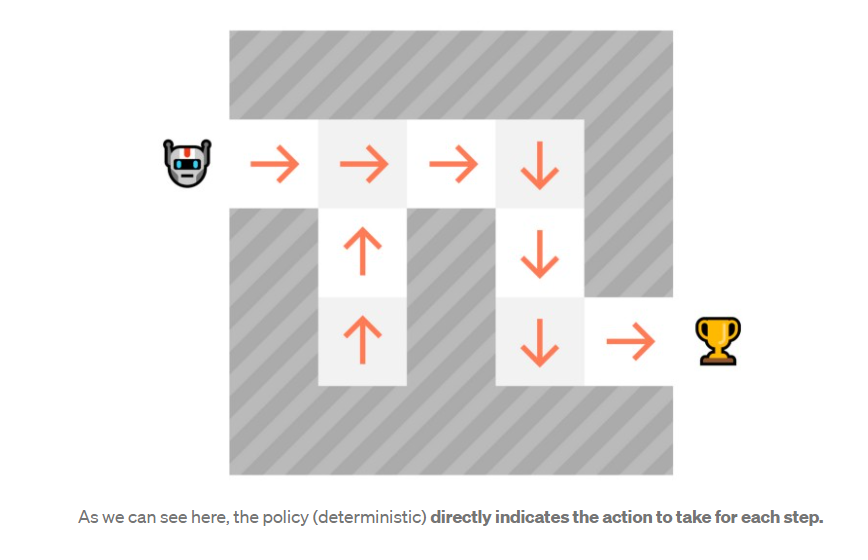

As we can see here, the policy (deterministic) **directly indicates the action to take for each step.**

policy-based 就是知道接下来的动作是什么，但是每个动作有相应的概率，按照这个概率执行

We have two types of policy:

- *Deterministic*: a policy at a given state **will always return the same action.**

  - 确定性的，在一个给定的状态下总是返回同样的动作

  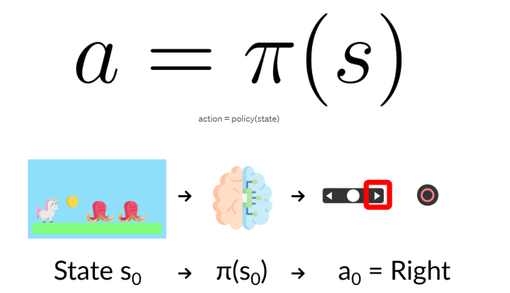

- *Stochastic*: output **a probability distribution over actions.**

  - ​	随机的，输出操作的概率分布。

  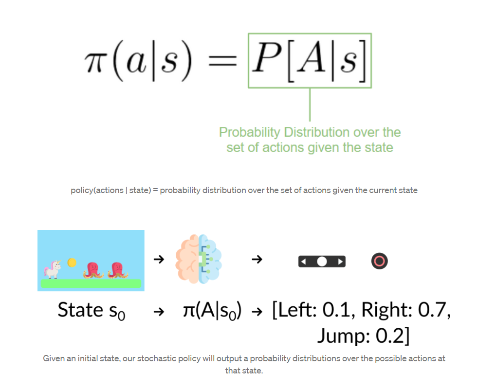

不知道执行哪个动作，但是知道都有什么动作，并且会有一个动作的概率分布

#### Value based methods

In Value based methods, instead of training a policy function, we **train a value function** that maps a state to the expected value **of being at that state.**

在 基于价值的方法 中， 我们训练一个**值函数**，将一个状态映射到该状态的期望值

The value of a state is the **expected discounted return** the agent can get if it **starts in that state, and then act according to our policy.**

这个值，是一个经过折扣的值， 

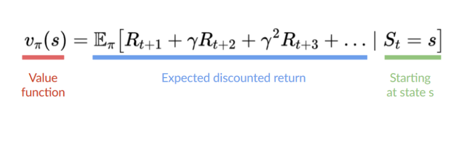

Here we see that our value function **defined value for each possible state.**

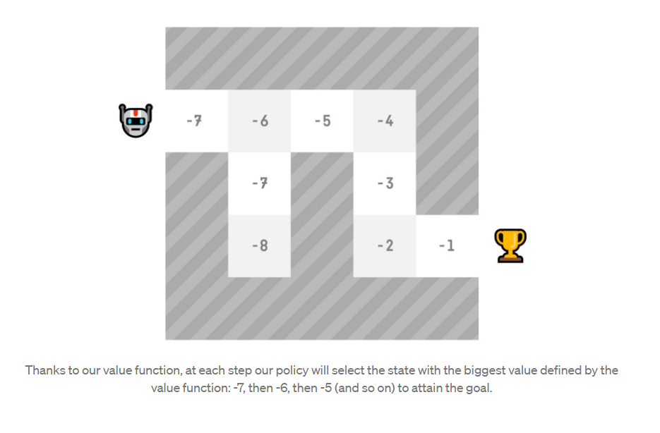

Thanks to our value function, at each step our policy will select the state with the biggest value defined by the value function: -7, then -6, then -5 (and so on) to attain the goal.

If you are not familiar with Deep Learning you definitely should watch the MIT Intro Course on Deep Learning (Free)

http://introtodeeplearning.com/

